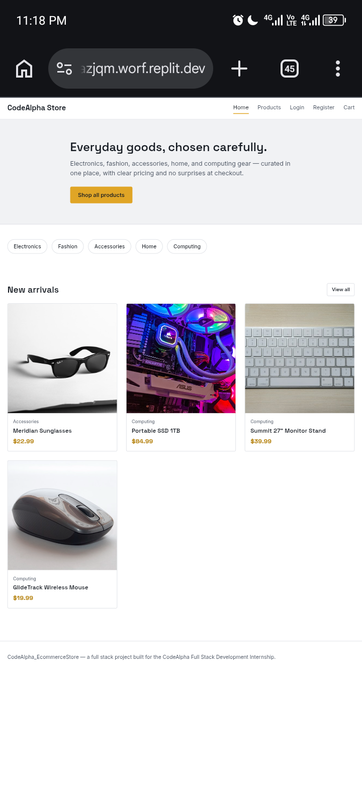
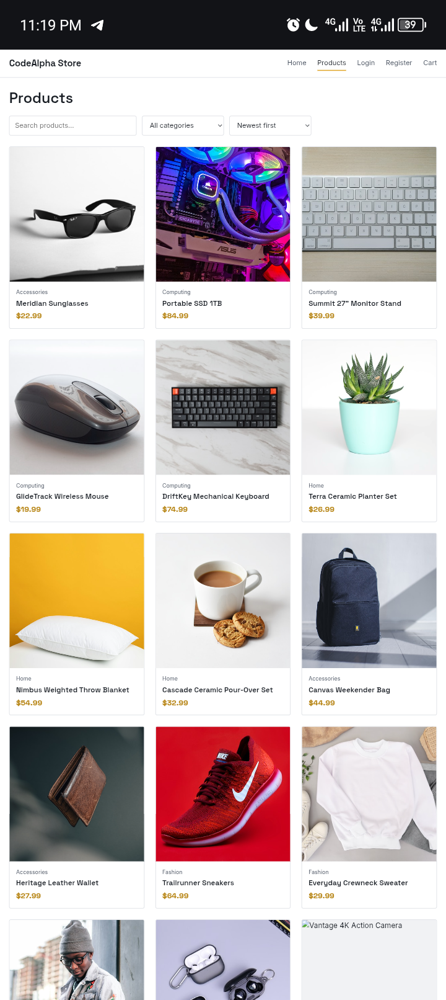
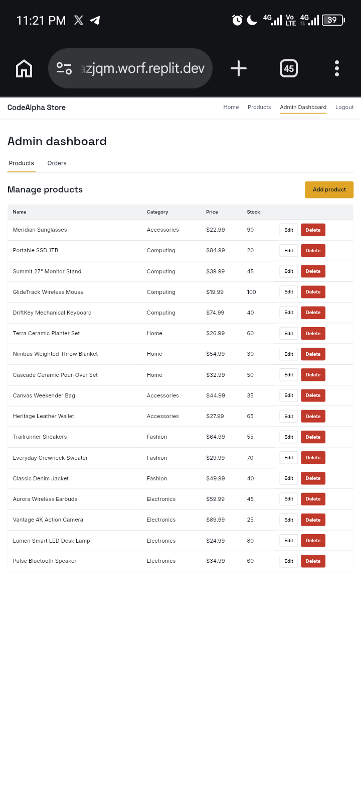
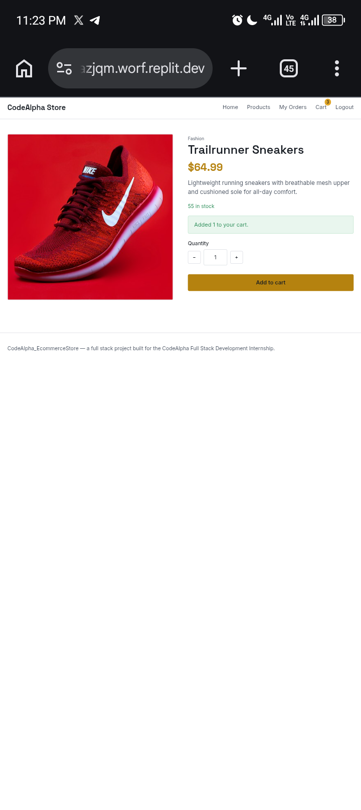
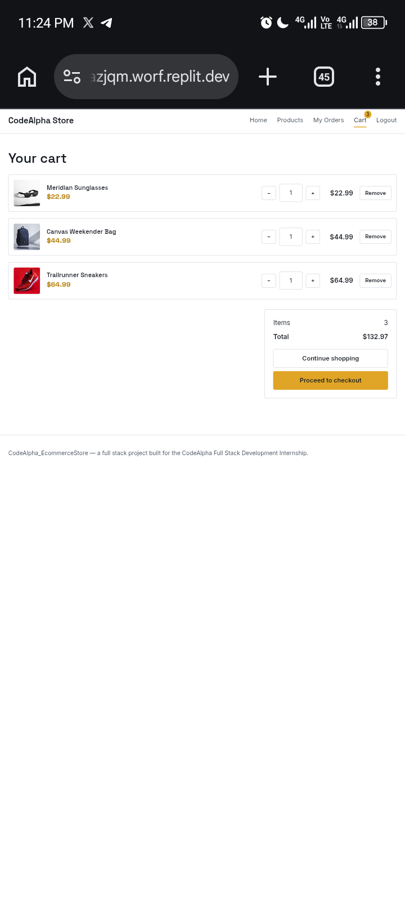
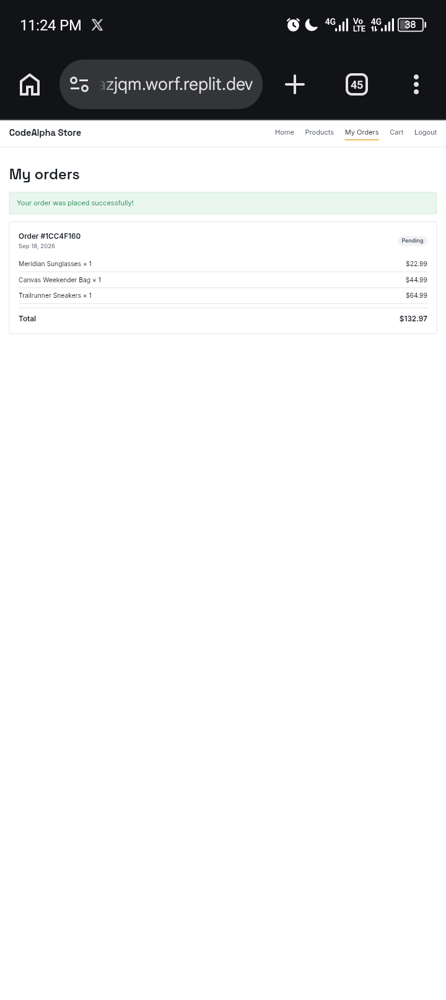
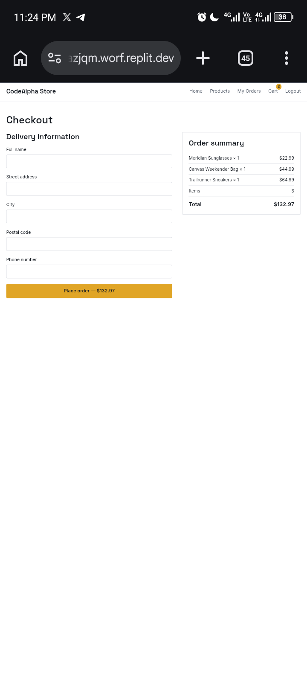

# CodeAlpha_EcommerceStore

A full stack e-commerce web application built for **Task 1 of the CodeAlpha Full Stack Development Internship**. Users can browse products, view product details, create accounts, log in, add products to a shopping cart, and place orders. Admins can manage the product catalogue and order statuses through a dedicated dashboard.

Built with a vanilla HTML/CSS/JavaScript frontend and a Node.js/Express/MongoDB backend — no frontend framework, per the internship's requirements.

---

## Features

**Customer-facing**
- User registration and login with JWT authentication
- Passwords hashed with bcrypt — never stored in plain text
- Browse, search, filter (by category), and sort products
- Product details page with stock-aware quantity selector
- Persistent shopping cart (add, update quantity, remove) with live totals
- Checkout with delivery information and order review
- Order history with real-time status (Pending, Processing, Shipped, Delivered, Cancelled)

**Admin**
- Role-based access control (`user` / `admin`)
- Product management: create, edit, delete
- Order management: view all orders, update order status

**Engineering**
- RESTful API with consistent JSON responses and proper HTTP status codes
- Server-side validation on every write — prices and stock are never trusted from the client
- Stock is validated and decremented atomically at checkout (MongoDB transaction)
- Centralized error handling
- Loading, empty, and error states throughout the UI
- Responsive design (mobile, tablet, desktop) with keyboard-accessible forms and `aria-live` alerts

---

## Technology Stack

| Layer | Technology |
|---|---|
| Frontend | HTML5, CSS3, Vanilla JavaScript |
| Backend | Node.js, Express.js |
| Database | MongoDB with Mongoose |
| Auth | JWT, bcryptjs |
| Other | dotenv, CORS, express-validator, morgan |

---

## Project Structure

```
CodeAlpha_EcommerceStore/
│
├── client/
│   ├── index.html, products.html, product.html
│   ├── login.html, register.html
│   ├── cart.html, checkout.html, orders.html
│   ├── admin.html
│   ├── css/style.css
│   └── js/
│       ├── api.js         # fetch wrapper, auth state, nav rendering
│       ├── auth.js        # login/register forms
│       ├── products.js    # browse, search, filter, sort
│       ├── product-detail.js
│       ├── cart.js
│       ├── checkout.js
│       ├── orders.js
│       └── admin.js
│
├── server/
│   ├── config/db.js
│   ├── controllers/
│   │   ├── authController.js
│   │   ├── productController.js
│   │   └── orderController.js
│   ├── middleware/
│   │   ├── auth.js         # JWT verification
│   │   └── admin.js        # role check
│   ├── models/
│   │   ├── User.js
│   │   ├── Product.js
│   │   └── Order.js
│   ├── routes/
│   │   ├── auth.js
│   │   ├── products.js
│   │   └── orders.js
│   ├── seed/seedProducts.js
│   ├── utils/generateToken.js
│   └── server.js
│
├── .env.example
├── .gitignore
├── package.json
└── README.md
```

---

## Installation

```bash
git clone https://github.com/aminuabkrr/CodeAlpha_EcommerceStore.git
cd CodeAlpha_EcommerceStore
npm install
```

## Environment Variables

Copy `.env.example` to `.env` and fill in real values:

```bash
cp .env.example .env
```

| Variable | Description |
|---|---|
| `PORT` | Port the server runs on (default `5000`) |
| `NODE_ENV` | `development` or `production` |
| `MONGODB_URI` | MongoDB connection string (see below) |
| `JWT_SECRET` | Long random string used to sign auth tokens |

Generate a secure `JWT_SECRET`:
```bash
node -e "console.log(require('crypto').randomBytes(64).toString('hex'))"
```

## MongoDB Setup

This project uses [MongoDB Atlas](https://www.mongodb.com/cloud/atlas/register) (free tier):

1. Create a free M0 cluster
2. Under **Database Access**, create a database user
3. Under **Network Access**, allow access from your IP (or `0.0.0.0/0` for development)
4. Copy the connection string from **Connect → Drivers** and paste it into `MONGODB_URI` in your `.env`, adding a database name before the query string, e.g.:
   ```
   mongodb+srv://<user>:<pass>@cluster0.xxxxx.mongodb.net/codealpha_ecommerce?retryWrites=true&w=majority
   ```

## Running Locally

```bash
npm run dev
```

Visit `http://localhost:5000` in your browser. Confirm the API is up at `http://localhost:5000/api/health`.

## Seeding the Database

Populates the database with 17 realistic sample products across 5 categories (Electronics, Fashion, Accessories, Home, Computing):

```bash
npm run seed
```

---

## API Endpoints

**Auth**
| Method | Endpoint | Access |
|---|---|---|
| POST | `/api/auth/register` | Public |
| POST | `/api/auth/login` | Public |
| GET | `/api/auth/me` | Authenticated |

**Products**
| Method | Endpoint | Access |
|---|---|---|
| GET | `/api/products` | Public (supports `?search=`, `?category=`, `?sort=`) |
| GET | `/api/products/:id` | Public |
| POST | `/api/products` | Admin |
| PUT | `/api/products/:id` | Admin |
| DELETE | `/api/products/:id` | Admin |

**Orders**
| Method | Endpoint | Access |
|---|---|---|
| POST | `/api/orders` | Authenticated |
| GET | `/api/orders` | Authenticated (own orders; admin can pass `?all=true`) |
| GET | `/api/orders/:id` | Authenticated (owner or admin) |
| PUT | `/api/orders/:id/status` | Admin |

All responses follow the shape `{ success, data, message }` (or `{ success: false, message }` on error).

---

## Authentication

- Passwords are hashed with `bcryptjs` before storage — plain text passwords are never saved.
- On successful login/registration, a JWT is issued and stored client-side (`localStorage`).
- Protected routes require an `Authorization: Bearer <token>` header, verified by middleware.
- Admin-only routes additionally check the user's `role` field.

## Admin Access

To test admin functionality, register a normal account, then promote it directly in the database:

```js
// via mongosh or MongoDB Compass
db.users.updateOne({ email: "your-email@example.com" }, { $set: { role: "admin" } })
```

No account is promoted to admin through the API, by design — this is a deliberate security boundary.

---

## Testing

The project was tested manually end-to-end, covering:
- Registration, login, and duplicate-email/invalid-input rejection
- Product browsing, search, category filtering, and sorting
- Add-to-cart stock limits, both per-action and cumulative
- Full checkout flow with real server-side stock validation and decrement
- Order history and admin order-status updates
- Authorization boundaries (non-admins blocked from admin routes, users blocked from viewing others' orders)
- Loading, empty, and error states across all pages
- Responsive layout at mobile, tablet, and desktop widths

## Deployment

The application is fully functional and has been verified to run correctly in a local/cloud development environment (Node.js + MongoDB Atlas), confirmed via direct API testing (`curl` health checks, seeding, and full request/response cycles). A public hosted demo link will be added here once deployment is finalized.

To deploy yourself, this project is compatible with any Node.js hosting platform (Render, Railway, Replit Deployments, etc.) — set the same environment variables listed above in your host's secrets/environment configuration.

---

## Screenshots

*(Add screenshots here after replacing this section — home page, products page, product detail, cart, checkout, orders, admin dashboard)*









---

## Author

Built by Aminu Abubakar, as part of the CodeAlpha Full Stack Development Internship, Task 1.
